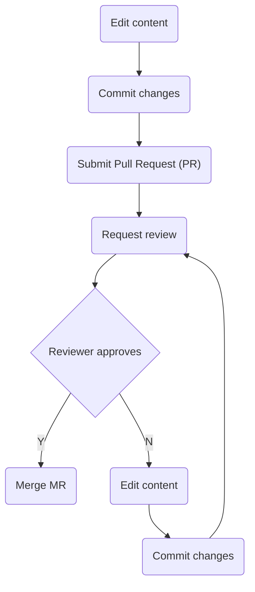

## On this page
{:.no_toc}

* TOC
{:toc}

## Introduction

This handbook describes how we run the Developer Experience and Community Success team at the Linux Foundation. If you are viewing the markdown soources on the repository, you can also view the rendered documentation at [the handbook site](https://linuxfoundation.github.io/devex-and-commsuccess-handbook/). The site is generally the best URL to bookmark and share.

All team members are [encouraged to contribute to the handbook](#how-to-edit-the-handbook).

## Communication

### 1-on-1s

1. Review this [one-on-one format and guidance](https://about.gitlab.com/handbook/leadership/1-1/) for reference and inspiration. We’re not expected to implement all recommendations there, though.
   1. Use a simple document format: add date for each 1:1 session and a bullet point agenda
   1. Use a numbered list to easily refer to a specific agenda point verbally and avoid confusion, in particular if we jump through points during the call
   1. Prepend the topic with your name
   1. Keep points succinct, feel free to expand to subpoints when necessary
   1. [Example 1:1 document](https://docs.google.com/document/d/1V9N0gdn_bZS1aJ_S3aTp7kiROBZ8LAvu-Kb5hekciiA)
1. Weekly cadence. Generally 25 minutes. The first set of 1:1s will be 40 minutes for your manager and you to get to know each other.
   1. Your manager will be open to extending the time when needed.
   1. Feel free to modify the calendar event to extend the time or to reschedule. The calendar invite owner, generally your manager, will ensure that the event is editable by guests. All edits will be welcome.
1. You and your manager co-own this document. Both of you are expected to add relevant content.
1. The document will be confidential to both you and your manager. This provides the ability to conduct conversations on confidential issues or to have performance and career-related discussions.
1. While status updates are welcome when relevant, 1:1 should not be dominated by updates, which can also go on the weekly reports. Instead, feel free to use to discuss concerns about your role and project, career development, and other topics that can help you succeed in your role.
1. Consider using the 1:1 doc as a live document and as a tool to capture thoughts or discussions you'd find useful to have with your manager. You can keep a bookmark to the document and add these points throughout the week, instead of a few minutes before the 1:1 call. This also helps each party review the agenda and be prepared for the call in advance.
1. Agenda items in the 1:1 will generally not be urgent. For items that are urgent, do not wait to the next 1:1 and reach out to your manager directly - generally Slack or e-mail.
1. Your manager will be receptive and open to suggestions and improvements on this 1:1 format.

### Team meeting

1. We'll be meeting as a team once a week for coordination, alignment and collaboration purposes
1. The [team meeting agenda](https://docs.google.com/document/d/1qa1m5FhZu6QRp42E-_mXp2_Tj5Y8h3JazYvemLwhI9E/edit) will be prepared in advance, using a similar format as described for #1-on-1s. Everyone in the team can contribute to the agenda and is encouraged to add topics that are relevant for discussion or visibility for the whole team.
1. To add a topic, simply add your name and a description of the topic you'd like to discuss –and be prepared to lead the discussion.
1. Everyone is encouraged to contribute with note-taking during the call. Meetings can also be recorded.
1. Notes and recordings should allow those not being able to attend in person to catch up async in their own time.

### Weekly reports

Each individual team member provides weekly updates to their manager, generally on a Friday. The main goals for these updates are: to provide awareness to leadership and peers on the projects’ and the team’s achievements, share knowledge and identify team-wide best practices, celebrate collaboration and to act on early warnings in order to neutralize concerns.

Instructions:

1. Make one single copy of the [Weekly status report template](https://docs.google.com/document/d/1CxZ30C0MfLB6TyeVP1I64InSRNa4YQE0MVWBSEDK2EM/edit) document and replace the title with your name. You'll be adding content to your one document every week.
1. Leave the sharing permissions set to "The Linux Foundation" and "Edit". If you are sharing confidential information, consider changing the people to share with to "Developer Experience and Community Success Team".
1. Add a link to your weekly report document to the links section of your [1:1 with your manager](#1-on-1s).
1. Add a link to your weekly report document to the links section of the [Developer Experience and Community Success team meeting agenda](#team-meeting).

Content format:

1. **Concerns**: any concerns you have about the project or your work
1. **Projects key accomplishments and contributions**: tell us what the projects you are working with accomplished and how you helped
1. **Kudos**: high fives to people who really helped out

Writing guidelines:

1. Keep the updates relatively short - akin to a weekly newsletter
1. Use [ISO dates](https://en.wikipedia.org/wiki/ISO_8601#Calendar_dates) (YYYY-MM-DD) in a multicultural environment, since [other formats lead to confusion](http://xkcd.com/1179/) :).
1. Strive to use [low-context communication](https://about.gitlab.com/company/culture/all-remote/effective-communication/#understanding-low-context-communication). Provide as much context as necessary to avoid uncertainty or confusion.
1. Add links where relevant for the reader to learn more about a specific update.

### Contacting the team

You can reach out to the whole Developer Experience and Community Success team in a manner of ways depending of the communication channel:

1. **Slack**: for general questions and conversations, feel free to join the [Developer Experience and Community Success Slack channel](https://linuxfoundation.slack.com/messages/devex-and-commsuccess). Generally a team member or someone who collaborates with the team will respond in a reasonable timeframe. If you know who you ask a specific question, feel free to mention them directly using their Slack handle.
   1. You can use the `@devex-and-comsuccess` handle to mention the whole group, from any channel within the Linux Foundation Slack workspace. It is more selective than using Slack's standard handles: [@channel](https://slack.com/help/articles/202009646-Notify-a-channel-or-workspace#u64channel) (as it sends a notification only to members of the group) and more direct than using [@here](https://slack.com/help/articles/202009646-Notify-a-channel-or-workspace#u64here) (as it sends a notification to all members of the group, regardless of their online status). Use it only when you really require the whole group's attention (e.g. important team notifications).
1. **E-mail**: you can use the `devex-and-commsuccess@linuxfoundation.org` address to send an e-mail to all team members. Currently only Linux Foundation members can send e-mail to that address, but it could potentially be open to external addresses if there is a future use case for that need. Use it if you need to discuss a topic or make an announcement more confidentially with the group.

### Comms channels

1. [Developer Experience and Community Success Slack channel](https://linuxfoundation.slack.com/messages/devex-and-commsuccess): the team's main communication channel for discussion and sharing knowledge related to our projects and communities. All members of the team are part of the channel, which is also open to anyone else in the organization who either wants to follow the work, ask questions or simply hang out to join. It is a public Slack channel for LF team members only.
1. [Community hangout Slack channel](https://linuxfoundation.slack.com/messages/community-hangout): the team's social channel. This is a space to share non-work related stories. What did you do last weekend? Show off your pets, show us your last family holiday pics, memes... In summary, a space to get to know each other by offering a window into what we're doing when we're not in front of the computer working. All team members are included by default, but it's voluntary to join/leave the channel. Feel free to share as much or as little as you like.

## How to edit the handbook

The handbook's content is written in [Markdown format](https://docs.github.com/en/get-started/writing-on-github/getting-started-with-writing-and-formatting-on-github/basic-writing-and-formatting-syntax). Familiarize with the syntax before doing your first edits.

For simplicity, GitHub's web UI is the proposed choice of editor for markdown files, and that which the workflow below assumes. Alternatively, more advanced users can also choose to check out the repository, do local edits and submit the changes in a PR.

Creating and curating the handbook is a collaborative effort where everyone in the team is encouraged to contribute. Since often the content will define common policies or processes, it will also be peer-reviewed. The act of doing reviews and approvals will generally be a compromise between consensus and bias for action. Everyone is encouraged to do a review, but the submitter will not generally require approval from the whole team to commit their changes, so that we can move faster. Exceptions might include defining critical team policies, where everyone's review and approval might be required before that policy is either approved, iterated upon or discarded.

### Edit workflow

Content contribution overview:

Content contribution in detail:

| Stage | UI | Description |
| --- | --- | --- |
| Edit |  | At this stage you are viewing the file you want to edit on the [handbook repository](https://github.com/linuxfoundation/devex-and-commsuccess-handbook). Any text file will have a pencil icon at the top right-hand corner, which you can click to start modifying the file on the web editor. This workflow will initiate the creation of a development branch to contain your changes on the main repository. |
| Commit changes |  | Once you are ready with your changes, you will want to commit them to save them under revision control. Scroll down to the bottom of the file you are editing to find the commit dialog. :information_source: Generally for commits you'll want to fill in the short description only. :information_source: Make sure you are using your `@linuxfoundation.org` e-mail address for the sign off :information_source: You can use the default for the branch name, or you can choose a name for your branch Finally click on <kbd>Sign off and propose changes</kbd> to commit those changes. |
| Submit Pull Request (PR) |  | Once the changes have been committed, GitHub will start the process of creating a PR, opening a similar dialog as in the previous stage. You can now review the description and changes before you submit the PR. :information_source: The short description will be the title of the PR. By default, GitHub prepopulates it with the short description of your last commit. Review it to ensure it describes the MR's purpose accurately :information_source: It's recommended to fill in the long description for PRs. This provides context for the reviewers to understand why you are proposing changes vs. what the changes are. :information_source: If your PR is a work in progress and you want to continue adding changes before it is reviewed, choose <kbd>Create draft pull request</kbd>. Otherwise choose <kbd>Create pull request</kbd>. Then click on the button to create it. |
| Request review |  | Once your PR has been submitted, a reviewer or more should be assigned to it for the ultimate review and approval. Pick one or more reviewers from your team, on the `Reviewers` section on the right-hand side panel of the web UI.  :information_source: Alternatively, you can also ask for a review by explicitly asking (mentioning) people on one of the PR's comments |
| Reviewer approves | TBD | The reviewer will get an e-mail notification. Once they are ready to review, they will generally look at the `Changes` tab to see a diff of what's been modified. If they are happy with the changes, they will approve them. If not, they'll point out what they feel needs to be changed for the submitter to address it. In that case, the reviewer will go back to the file in their branch, and restart the edit and commit process, which will automatically update the MR. |
| Merge MR | TBD | The final reviewer will generally merge the MR once one or more approvals have been received. The submitter will not generally approve their own requests. However, until we refine the process it should be fine for them to do so if the reviewers' approvals have been done. |

:information_source: Note for advanced users: members of the [Developer Experience and Community Success team](https://github.com/orgs/linuxfoundation/teams/devex-and-commsuccess-team) in the `linuxfoundation` organization in GitHub can create development branches directly under the repository where the handbook lives. These will be generally the ones that will be used to contain the changes submitted in PRs. It is not the most common development approach, but it simplifies our workflow. Working on forks and topic branches is also supported.
