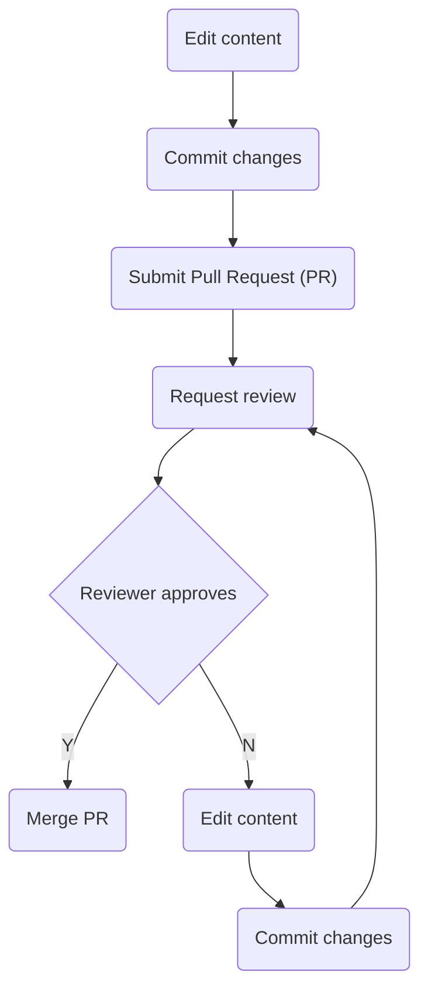

## On this page
{:.no_toc}

* TOC
{:toc}

## How to edit the handbook

The handbook's content is written in [Markdown format](https://docs.github.com/en/get-started/writing-on-github/getting-started-with-writing-and-formatting-on-github/basic-writing-and-formatting-syntax). Familiarize with the syntax before doing your first edits.

For simplicity, GitHub's web UI is the proposed choice of editor for markdown files, and that which the workflow below assumes. Alternatively, more advanced users can also choose to check out the repository, do local edits and submit the changes in a PR.

Creating and curating the handbook is a collaborative effort where everyone in the team is encouraged to contribute. Since often the content will define common policies or processes, it will also be peer-reviewed. The act of doing reviews and approvals will generally be a compromise between consensus and bias for action. Everyone is encouraged to do a review, but the submitter will not generally require approval from the whole team to commit their changes, so that we can move faster. Exceptions might include defining critical team policies, where everyone's review and approval might be required before that policy is either approved, iterated upon or discarded.

### Edit workflow

Content contribution overview:



Content contribution in detail:

| Stage | UI | Description |
| --- | --- | --- |
| Edit |  | At this stage you are viewing the file you want to edit on the [handbook repository](https://github.com/linuxfoundation/devex-and-commsuccess-handbook). Any text file will have a pencil icon at the top right-hand corner, which you can click to start modifying the file on the web editor. This workflow will initiate the creation of a development branch to contain your changes on the main repository. |
| Commit changes |  | Once you are ready with your changes, you will want to commit them to save them under revision control. Scroll down to the bottom of the file you are editing to find the commit dialog.<br>:information_source: Generally for commits you'll want to fill in the short description only.<br>:information_source: Make sure you are using your `@linuxfoundation.org` e-mail address for the sign off<br>:information_source: You can use the default for the branch name, or you can choose a name for your branch<br>Finally click on <kbd>Sign off and propose changes</kbd> to commit those changes. |
| Submit Pull Request (PR) |  | Once the changes have been committed, GitHub will start the process of creating a PR, opening a similar dialog as in the previous stage. You can now review the description and changes before you submit the PR.<br>:information_source: The short description will be the title of the PR. By default, GitHub prepopulates it with the short description of your last commit. Review it to ensure it describes the PR's purpose accurately<br>:information_source: It's recommended to fill in the long description for PRs. This provides context for the reviewers to understand why you are proposing changes vs. what the changes are.<br>:information_source: If your PR is a work in progress and you want to continue adding changes before it is reviewed, choose <kbd>Create draft pull request</kbd>. Otherwise choose <kbd>Create pull request</kbd>. Then click on the button to create it. |
| Request review |  | Once your PR has been submitted, a reviewer or more should be assigned to it for the ultimate review and approval. Pick one or more reviewers from your team, on the `Reviewers` section on the right-hand side panel of the web UI. <br>:information_source: Alternatively, you can also ask for a review by explicitly asking (mentioning) people on one of the PR's comments |
| Reviewer approves | TBD | The reviewer will get an e-mail notification. Once they are ready to review, they will generally look at the `Changes` tab to see a diff of what's been modified. If they are happy with the changes, they will approve them. If not, they'll point out what they feel needs to be changed for the submitter to address it. In that case, the reviewer will go back to the file in their branch, and restart the edit and commit process, which will automatically update the PR. |
| Merge PR | TBD | The final reviewer will generally merge the PR once one or more approvals have been received. The submitter will not generally approve their own requests. However, until we refine the process it should be fine for them to do so if the reviewers' approvals have been done. |

:information_source: Note for advanced users: members of the [Developer Experience and Community Success team](https://github.com/orgs/linuxfoundation/teams/devex-and-commsuccess-team) in the `linuxfoundation` organization in GitHub can create development branches directly under the repository where the handbook lives. These will be generally the ones that will be used to contain the changes submitted in PRs. It is not the most common development approach, but it simplifies our workflow. Working on forks and topic branches is also supported.

### Handbook structure

The handbook's structure is conceived to be initially simple. As such, most of the relevant content will be on the front page's `README.md` file.

If content needs to be added to its specific section (e.g. a lengthy, self-contained topic), it can also go into a new subpage. In practical terms, the subpage will be a folder in the root directory of the repository, which will include a `README.md` file with the content. Generally, the subpage will be linked to from somewhere else in the handbook for discoverability. At this point, for simplicity and given the fact that breadcrumb navigation is not supported, nested subfolders are not recommended.

To add links to a subpage, use the regular Markdown link syntax and the name of the subpage, which will be the same one as the folder that contains the `README.md` file with the content. Example:

```
All team members are [encouraged to contribute to the handbook](how-to-edit-the-handbook).
```

The links in the `README.md` files will automatically be converted to valid, relative HTML links when the [handbook site](#repository-vs-site) is rendered.

### Repository vs site

The handbook is hosted on GitHub as a set of `README.md` files written in plain text formatted as Markdown. Given that GitHub renders `README.md` files as HTML when navigating through a repository, the handbook content can be consumed directly from the repository itself through the browser.

The handbook is also set up to use GitHub Pages, which automatically render the `README.md` file into rich HTML pages hosted on a dedicated site with its own URL. Consuming the handbook content through the site is recommended for most users, as it provides a cleaner, read-only user interface with added features, such as Tables of Contents.

The website is updated and deployed every time a PR is merged. GitHub Pages uses Jekyll as the static website generator engine to serve the content.

#### Table of contents

While GitHub's web view of the `README.md` files does not support an auto-generated Table of Contents (TOC), this can be added to the rendered content on the site. Simply add this snippet on top of each `README.md` file:

```
## On this page
{:.no_toc}

* TOC
{:toc}
```

[Learn more about this syntax](https://kramdown.gettalong.org/converter/html.html#toc).

### Handbook style guide

1. The handbook represents the current state and is assumed to be up-to-date. Do not document historical content or future states, unless explicitly describing a roadmap, mission or vision.
1. Use [GitHub flavored Markdown format](https://docs.github.com/en/get-started/writing-on-github/getting-started-with-writing-and-formatting-on-github/basic-writing-and-formatting-syntax) to write content
1. Use [sentence case](https://en.wikipedia.org/wiki/Letter_case#Sentence_case) for section titles
1. Use H2 titles (`##` in Markdown) as the top level header for section titles. Child sections will continue as H3 (`###`), H4 (`####`), and so forth. Strive to keep a shallow title depth for simplicity.
