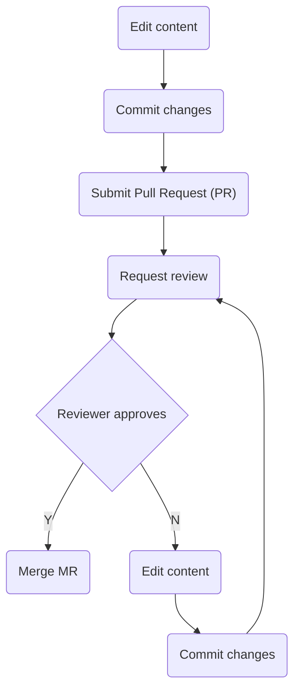

## On this page
{:.no_toc}

* TOC
{:toc}

### Edit workflow

Content contribution overview:

Content contribution in detail:

| Stage | UI | Description |
| --- | --- | --- |
| Edit |  | At this stage you are viewing the file you want to edit on the [handbook repository](https://github.com/linuxfoundation/devex-and-commsuccess-handbook). Any text file will have a pencil icon at the top right-hand corner, which you can click to start modifying the file on the web editor. This workflow will initiate the creation of a development branch to contain your changes on the main repository. |
| Commit changes |  | Once you are ready with your changes, you will want to commit them to save them under revision control. Scroll down to the bottom of the file you are editing to find the commit dialog. :information_source: Generally for commits you'll want to fill in the short description only. :information_source: Make sure you are using your `@linuxfoundation.org` e-mail address for the sign off :information_source: You can use the default for the branch name, or you can choose a name for your branch Finally click on <kbd>Sign off and propose changes</kbd> to commit those changes. |
| Submit Pull Request (PR) |  | Once the changes have been committed, GitHub will start the process of creating a PR, opening a similar dialog as in the previous stage. You can now review the description and changes before you submit the PR. :information_source: The short description will be the title of the PR. By default, GitHub prepopulates it with the short description of your last commit. Review it to ensure it describes the MR's purpose accurately :information_source: It's recommended to fill in the long description for PRs. This provides context for the reviewers to understand why you are proposing changes vs. what the changes are. :information_source: If your PR is a work in progress and you want to continue adding changes before it is reviewed, choose <kbd>Create draft pull request</kbd>. Otherwise choose <kbd>Create pull request</kbd>. Then click on the button to create it. |
| Request review |  | Once your PR has been submitted, a reviewer or more should be assigned to it for the ultimate review and approval. Pick one or more reviewers from your team, on the `Reviewers` section on the right-hand side panel of the web UI.  :information_source: Alternatively, you can also ask for a review by explicitly asking (mentioning) people on one of the PR's comments |
| Reviewer approves | TBD | The reviewer will get an e-mail notification. Once they are ready to review, they will generally look at the `Changes` tab to see a diff of what's been modified. If they are happy with the changes, they will approve them. If not, they'll point out what they feel needs to be changed for the submitter to address it. In that case, the reviewer will go back to the file in their branch, and restart the edit and commit process, which will automatically update the MR. |
| Merge MR | TBD | The final reviewer will generally merge the MR once one or more approvals have been received. The submitter will not generally approve their own requests. However, until we refine the process it should be fine for them to do so if the reviewers' approvals have been done. |

:information_source: Note for advanced users: members of the [Developer Experience and Community Success team](https://github.com/orgs/linuxfoundation/teams/devex-and-commsuccess-team) in the `linuxfoundation` organization in GitHub can create development branches directly under the repository where the handbook lives. These will be generally the ones that will be used to contain the changes submitted in PRs. It is not the most common development approach, but it simplifies our workflow. Working on forks and topic branches is also supported.
